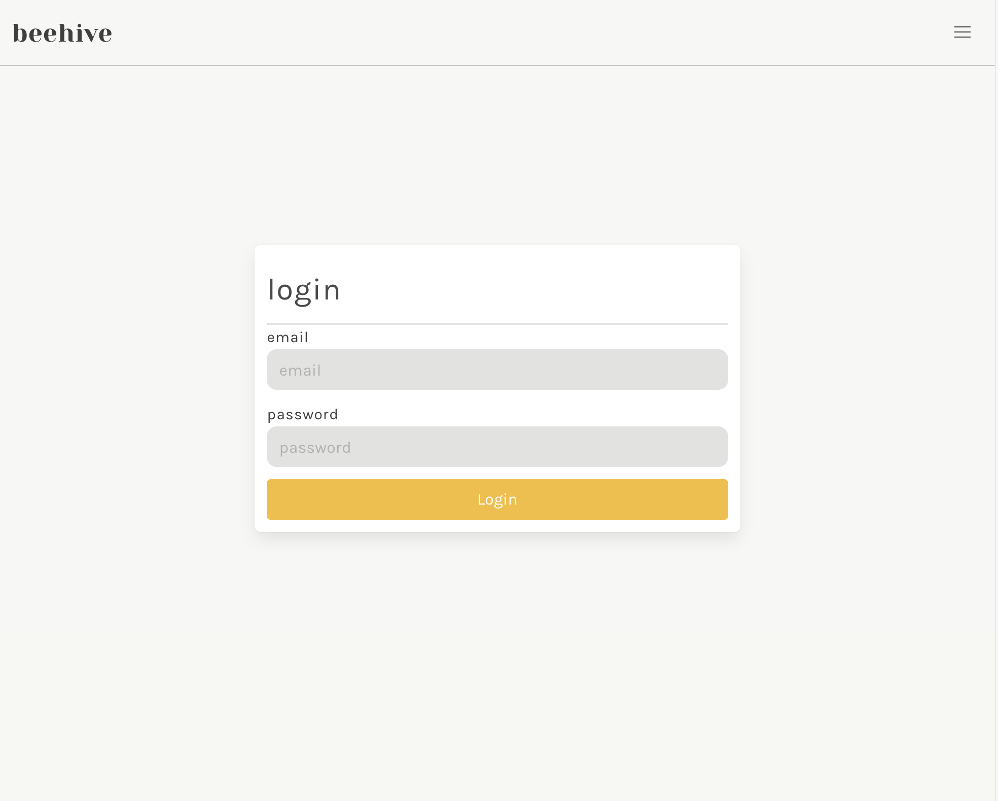
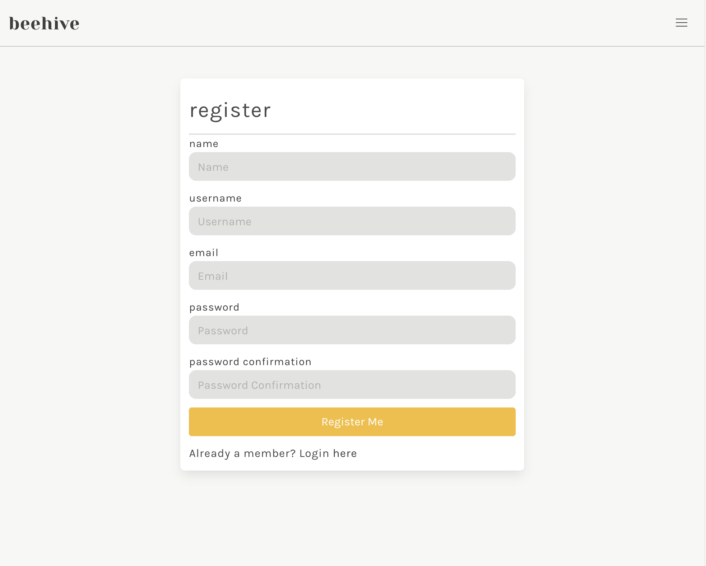
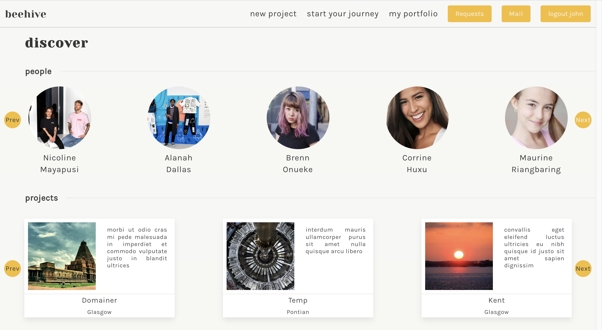
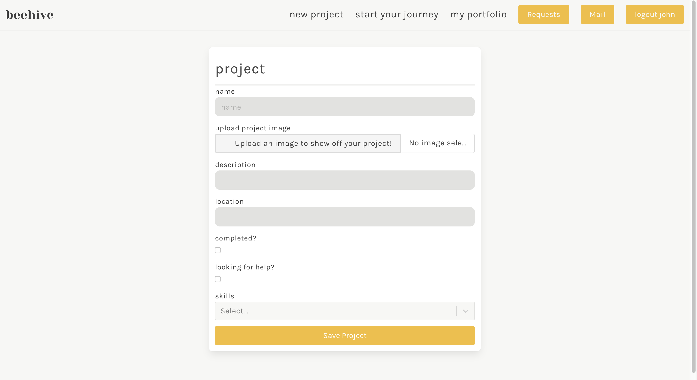
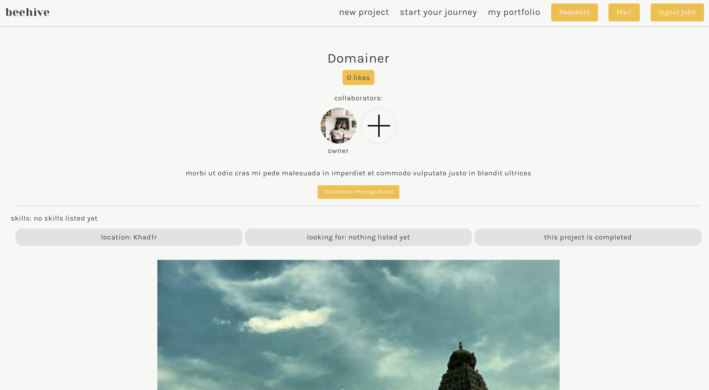
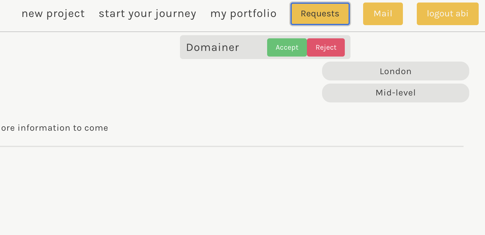

# Software Engineering Immersive: Project 3 (Group Project)
This is a group project I built in collaboration with three other classmates during the General Assembly Software Engineering Immersive course (Week 9).

## Team Mates:
- [Abigail Foreman](https://github.com/abigailforeman1)
- [Jos Bogan](https://github.com/JosBogan/)
- [Nicolas Dolan](https://github.com/Nicolas-Dolan)

---

# Beehive

A professional networking website for creative professional either looking for work or for companies looking for creatives.

## Built With

1. HTML5
2. SCSS & Bulma
3. Javascript
   * ECMAScript6
   * React.js
   * Node.js
   * Express.js
4. NoSQL
   * MongoDB
5. Testing
   * Manual: Insomnia
   * Automated: Mocha & Chai
5. GitHub
6. Cloudinary

## Deployment

This web app is deployed on Heroku and it can be found here: https://beehive-creative-tool.herokuapp.com/

## Getting Started

Use the clone button to download the source code. In the terminal enter the following commands:

```
<!-- To install all the packages listed in the package.json: -->
$ yarn
<!-- Run the app in your localhost: -->
$ yarn start
<!-- Check the console for any issues and if there are check the package.json for any dependancies missing  -->
```

# User Experience

## Login & Register

The landing of the website gives the user three options. They can register, login or start there journey (search to see other users and projects). If the user registers, they will then be sent to the login page. If the user is login in for the first time they will be shown a different message with more information and options to improve their experience of Beehive.




#
## Discover

After login in the user is shown the discover page. This is a page that curates current projects and users that the user might want to check out.



#
## Upload Projects

The user can upload projects. Projects are either show pages for something the user has already created or a request to find collaborators to join a project. The user can upload images to their project which is connect to [Cloudinary](https://cloudinary.com/)



#
## Projects

Once in a project, the user can click the plus button to either request to be a collaborator or if you are the owner of the project, use this to add other collaborators. A user is not added to the project until the request has been accepted. 



#
## Chat

A user is able to chat to any other user on the platform. They do this by going to the user's profile and clicking on the chat button. The other user will be sent a request to chat that they will see when they log in.


#
## Request

When a user wants to join a project or a project owner wants a user they can send a request. The user will get a request the next time they login and can choose whether to accept or reject that request.



# My contributions 

## Project Management

I was charged with organising tasks and prevent duplication of work. We did this using Trello, a morning stand up and an evening debrief. I set up the Trello board to have: Tasks Today, Tasks in Progress, Tasks in Testing, Tasks Completed, Tasks Roadblocked, & Tasks Iced boxed. Every morning I held a stand up to asign tasks and then a debrief at the end of the day to plan tasks for the next days Trello board. The icebox was use when a task was nice feature but due to time constrints was not an urgent feature.


## Testing

I wrote all the tests for the backend database. I had confidence with Mocha & Chai and wanted to improve my practical knowledge as testing is an important aspect of a junior's role. The tests uncovered issues that were resolved such as:

* Error handling was sending back console logs, not messages.
* Errors were sending back 200 responses
* 400 errors were being used for everything rather than specific status.
* Users could edit other user's comments.

The most time-consuming part of this was creating the data to generate the tests. For comments, first users needed to be generated. Then projects that were assigned a user. Then comments that are assigned to both a user and a project.

## Seeds

The seeds file was created by me and contain 44 projects and 104 users. We wanted to create a large number of users and projects to be able to show how to website would look in the real world. The data was generated using [Mockaroo](https://mockaroo.com/). To generate the project and user images, we searched for photos on Bing that had a licence we could use. The source of the images were scrapes using JavaScript in the dev console.
```javascript
  copy([].slice.call(document.querySelectorAll(".img_cont img")).map(i => i.src))
```

This code for written by me to get all images on the page, turn that list from a NodeList to an array and then map the array so it only brings back the source.

## Backend Error Validation


## My favourite code snippets I wrote: 

--- FRONTEND ---

I'm most proud of building the search capabilities of the site. A user was able to search for all users and projects in a dynamic and fast way. This was done by using 6 components to separate functionality, make it more readable and reusable. This involved:
* Search Component - the main page that is showed to the user
* Search Form - component to filter if the user wants to search users or projects. If one is selected, the form is expanded.
* Search Project Form - form on the search component that appears when search form has project selected and filters project cards
* Search User Form - form on the search component that appears when search form has user-selected and filters user cards
* Search Project Cards - maps available projects based on the filters.
* Search User Cards - maps available users based on the filters.


I built the filter feature which allows the user to filter through the site's projects and users at the same time:

  
```javascript
              <div className="user_results_container">
                {this.state.formData.searchingFor === 'users' && this.state.users.filter(i => {
                  const skillArray = i.skills.map(item => item.skill)                
                  return (                
                    new RegExp(this.state.userForm.name,'i').test(i.name) &&
                    new RegExp(this.state.userForm.location,'i').test(i.location) &&
                    new RegExp(this.state.userForm.username,'i').test(i.username) &&
                    (!this.state.userForm.level[0] || this.state.userForm.level.some(item => i.level.indexOf(item) >= 0)) &&
                    (!this.state.userForm.professions[0] || this.state.userForm.professions.some(item => i.professions.indexOf(item) >= 0)) &&
                    (!this.state.userForm.skills[0] || this.state.userForm.skills.some(item => skillArray.indexOf(item) >= 0))
                  )
                })
```
```javascript
<div className="project_results_container">
                {this.state.formData.searchingFor === 'projects' && this.state.projects.filter(i => {
                  
                  return (
                    new RegExp(this.state.projectForm.name,'i').test(i.name) &&
                    new RegExp(this.state.projectForm.location,'i').test(i.location) &&
                    (!this.state.projectForm.recruiting || (this.state.projectForm.recruiting === true && i.recruiting === true)) &&
                    (!this.state.projectForm.lookingFor[0] || this.state.projectForm.lookingFor.some(item => i.lookingFor.indexOf(item) >= 0)) &&
                    (!this.state.projectForm.skillsInvolved[0] || this.state.projectForm.skillsInvolved.some(item => i.skillsInvolved.indexOf(item) >= 0))
                  )
                })                        
                  .map(item => {
                    return (                                        
                      <div className="search_project_card" key={item._id} >
                        <ProjectCard {...item} />
                      </div> 
                    )
                  })}
```


## Challenges & future improvements

Managing expectations and features in the project were the largest challenge. There were many features people were wanting to create to make the project bigger but at the detriment to the robustness of the product. We changed the CSS framework we were using and underestimated how long styling would take. Luckily we have managed scope creep and iceboxed a lot of features so finished the project with a buffer for issues.

Future improvements would be to install WebSocket when chatting instead of relying on a RESTful API that needs to be re-pulled to show new messages.